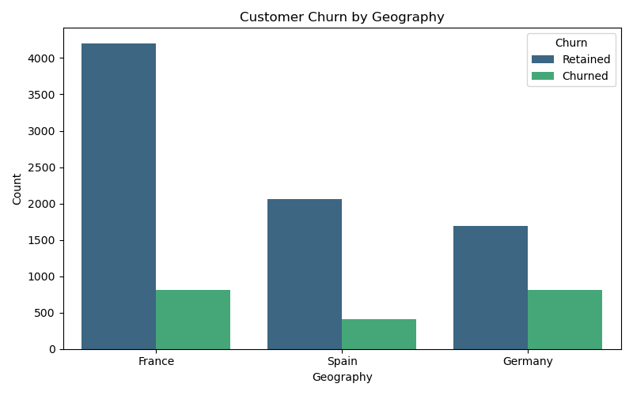
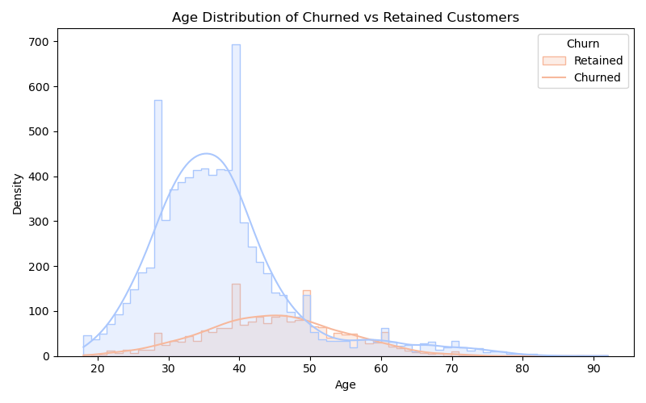
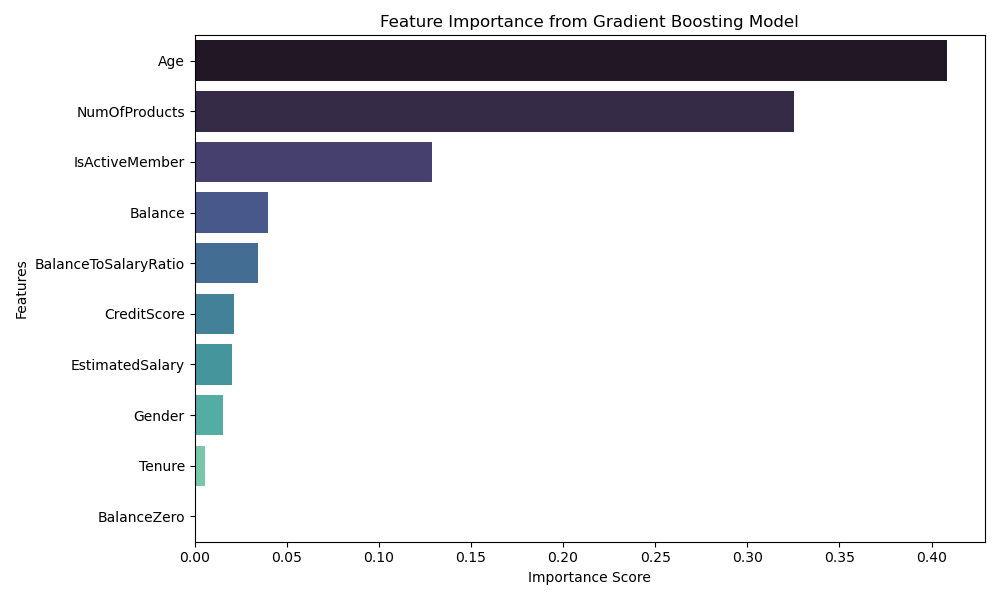

# Customer Churn Prediction and Analysis

Summary: Analyzing and predicting customer churn for a bank, using a dataset containing customer demographics, account information, and transactional details. The primary goal is to uncover actionable insights to reduce churn and build predictive models that can identify high-risk customers.

---

## Table of Contents
- [Introduction](#introduction)
- [Dataset Overview](#dataset-overview)
- [Data Preprocessing](#data-preprocessing)
- [Exploratory Data Analysis (EDA)](#exploratory-data-analysis-eda)
- [Feature Engineering](#feature-engineering)
- [Modeling and Evaluation](#modeling-and-evaluation)
- [Key Insights and Takeaways](#key-insights-and-takeaways)
- [Conclusion](#conclusion)
- [Future Work](#future-work)
- [References](#references)

---

## Introduction

Customer churn is an important feature faced by businesses, as retaining existing customers is more cost-effective than acquiring new ones. This project aims to:
- Identify key drivers of customer churn.
- Build predictive models to forecast customer churn.
- Provide actionable insights for retention strategies.

The dataset used is sourced from Kaggle and represents a bank's customer data.

---

## Dataset Overview

The dataset contains ~10,000 records with the following key features:
- **Customer Information:** Customer ID, geography, gender, age.
- **Account Details:** Tenure, balance, number of products, and estimated salary.
- **Behavioral Information:** Whether the customer is active or exited, and their credit score.
- **Target Variable:** `Exited` – whether the customer churned (1) or remained (0).

**Objective:** Identify patterns in customer behavior that predict churn and build effective classification models.

---

## Data Preprocessing

Dataset preparation steps:
1. **Handling Missing Values:** Verified that the dataset had no null values.
2. **Encoding Categorical Features:** 
   - Converted `Gender` using label encoding.
   - One-hot encoded `Geography` to represent regions (France, Germany, Spain).
3. **Feature Scaling:**
   - Standardized numerical features (`CreditScore`, `Balance`, `EstimatedSalary`) to improve model performance.
4. **Class Balance:**
   - Verified the dataset had a balanced churn rate (20% churned, 80% retained).

---

## Exploratory Data Analysis (EDA)

Key insights uncovered:
1. **Geography Matters:** Customers in Germany have significantly higher churn rates compared to France and Spain.
2. **Age Factor:** Older customers (above 50) tend to churn more, suggesting the need for targeted retention strategies for senior customers.
3. **Tenure Relationship:** Customers with shorter tenures (1-3 years) show higher churn rates, likely due to less established relationships with the bank.
4. **High Balance Churn:** Customers with high account balances are paradoxically more likely to churn, potentially indicating dissatisfaction despite financial stability.
5. **Active Membership:** Active members are less likely to churn, reinforcing the importance of customer engagement.

**Visualizations:**
- Churn rate by geography (bar chart).
- Age distribution of churned vs. retained customers (histogram).
- Correlation heatmap showing relationships between features.
## Visualizations

### 1. Customer Churn by Geography
Distribution of churn across different regions, highlighting that Germany has a significantly higher churn rate compared to other regions.

---

### 2. Age Distribution of Churned vs Retained Customers
How age impacts churn. Older customers, particularly those above 50, are more likely to churn.

---

### 3. Feature Importance from Gradient Boosting Model
Most important features influencing churn predictions, with age, product usage, and active membership being the key contributors.

---

## Feature Engineering

To improve model performance:
1. **Binary Feature for Zero Balance:** Added `BalanceZero` (1 if `Balance` is 0).
2. **Age Grouping:** Segmented ages into bins (e.g., 18-25, 26-35).
3. **Balance-to-Salary Ratio:** Created a new feature to capture financial dependence on account balance.
4. **Interaction Features:** Combined `NumOfProducts` and `IsActiveMember` into `ProductUsage` to capture behavioral trends.
5. **Tenure Buckets:** Grouped tenure into intervals (e.g., 0-2 years, 3-5 years).

---

## Modeling and Evaluation

Three classification models were implemented and compared:
1. **Logistic Regression:** Baseline model with simple interpretability.
2. **K-Nearest Neighbors (KNN):** Captures local decision boundaries.
3. **Gradient Boosting Machine (GBM):** Advanced tree-based model for high accuracy.

**Evaluation Metrics:**
- **Accuracy**
- **Precision**
- **Recall**
- **F1-Score**

**Results:**
- **Logistic Regression:** 79% accuracy.
- **KNN:** 83% accuracy (optimal `k=5`).
- **GBM:** 86% accuracy, outperforming other models.

---

## Key Insights and Takeaways

1. **High-Risk Groups:**
   - German customers, older customers (50+), and customers with high balances represent the most at-risk groups.
2. **Retention Strategies:**
   - For high-balance churners, improve service satisfaction through personalized banking experiences.
   - Implement loyalty programs for customers with short tenure or those residing in high-churn regions like Germany.
3. **Behavioral Predictors:**
   - Engagement matters: Active members are significantly less likely to churn.
   - Product usage and tenure are key drivers of retention.

---

## Conclusion

We found actionable insights into the factors driving customer churn and demonstrates the application of machine learning models to predict churn effectively. By focusing on high-risk customer segments and improving engagement, businesses can reduce churn and improve profitability.

---

## Future Work

To extend this project:
1. **Feature Enhancement:** Incorporate external data (e.g., macroeconomic indicators) for more robust predictions.
2. **Advanced Models:** Experiment with deep learning techniques for further accuracy improvements.

---

## References

- [Customer Churn Dataset on Kaggle](https://www.kaggle.com/datasets/shrutimechlearn/churn-modelling/data)

---